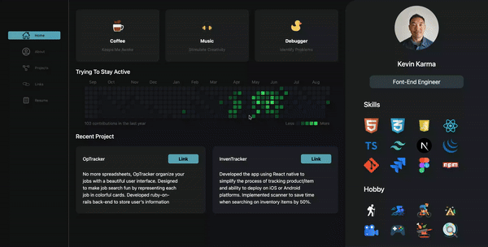

# Dashboard Portfolio
###A modern, interactive dashboard portfolio built with Next.js 14 and Tailwind CSS.

#Features
- Responsive design
- Customizable theme
- Data visualization charts
- Project highlights
- Contact form

# Getting Started
- Clone the repository:
  `get clone https://github.com/TenNga/nextjs-portfolio.git`
- Install dependencies:
  `cd nextjs-portfolio`
  `npm install`
- Start the development server:
  `npm run dev`
# Deployment
[Follow the instructions above]

# Contributing
- Feel free to fork this repository and submit pull requests with improvements or new features.

# Design using Figma

# Screen Shot

